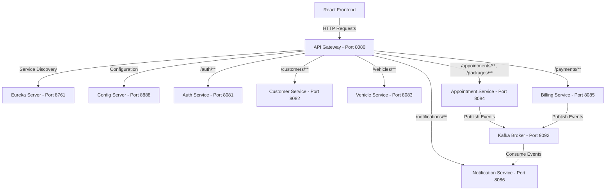

# Vehicle Service Management (VSM) System
## API Reference & React Frontend Implementation Guide

This document provides a comprehensive overview of the **Vehicle Service Management (VSM)** microservice system. It outlines the functionalities of each service, describes how the API Gateway secures and routes requests, lists all endpoints with dummy JSON payloads, and provides a reference architecture for building a React-based frontend.

---

## 1. System Architecture & Flow

The application is built using a **Spring Cloud microservice architecture** with the following components:



### Communication Protocols
*   **Synchronous REST (HTTP/JSON)**: Used for all client-to-gateway and gateway-to-service requests.
*   **Asynchronous Messaging (Kafka)**: Used for service-to-service event propagation (e.g., notifying customers when appointments are booked or paid).
*   **Service Discovery (Eureka)**: Dynamically resolves service instances (`lb://<service-name>`).
*   **Centralized Configuration (Config Server)**: Manages application profiles and credentials natively via `config-repo`.

---

## 2. Core Functionalities & Role-Based Access Control (RBAC)

The project supports four distinct roles:
1.  **CUSTOMER**: Can register, create/update their profile, register vehicles, book appointments, view service packages, complete payments, and receive custom notifications.
2.  **MECHANIC**: Assigned to specific appointments; can view appointments and update appointment statuses (e.g., marking them as `IN_PROGRESS` or `COMPLETED`).
3.  **SERVICE_ADVISOR**: Manages scheduling; can view and update appointment statuses.
4.  **ADMIN**: Has full controls; can create, update, or delete service packages, manage all appointments, and perform overall administration.

### RBAC Enforcement at the API Gateway
The `api-gateway` enforces role-based rules inside `AuthenticationFilter.java`:
*   **Service Packages Modification**: Only **ADMIN** can modify packages (methods `POST`, `PUT`, `DELETE` at `/packages/**`). Everyone authenticated can perform `GET`.
*   **Appointment Status Modification**: Only **ADMIN**, **MECHANIC**, and **SERVICE_ADVISOR** can update appointment statuses (method `PATCH` at `/appointments/**/status`).

---

## 3. Microservice Details & Endpoint Reference

> [!IMPORTANT]
> All calls to downstream microservices (except public registration/login) **must** go through the **API Gateway** running at **`http://localhost:8080`** and must include the Header:
> `Authorization: Bearer <JWT_TOKEN>`

---

### A. Authentication Service (`auth-service`)
*   **Responsibility**: Manages user registration, secure password hashing, login, and JWT generation (valid for 10 hours containing the `role` claim).
*   **Database**: `auth1_db`
*   **Port**: `8081`

#### 1. Register User
*   **HTTP Method**: `POST`
*   **Path**: `/auth/register`
*   **Authentication**: None (Public)
*   **Description**: Registers a new user.
*   **Request Body**:
    ```json
    {
      "username": "johndoe",
      "password": "securepassword123",
      "email": "johndoe@example.com",
      "role": "CUSTOMER"
    }
    ```
    *Note: Roles must be one of `CUSTOMER`, `ADMIN`, `MECHANIC`, `SERVICE_ADVISOR`.*
*   **Response (200 OK)**:
    ```json
    "User registered successfully"
    ```

#### 2. Login & Authenticate
*   **HTTP Method**: `POST`
*   **Path**: `/auth/login`
*   **Authentication**: None (Public)
*   **Description**: Authenticates user credentials and generates a JWT.
*   **Request Body**:
    ```json
    {
      "username": "johndoe",
      "password": "securepassword123"
    }
    ```
*   **Response (200 OK)**:
    ```json
    {
      "token": "eyJhbGciOiJIUzI1NiJ9.eyJyb2xlIjoiQ1VTVE9NRVIiLCJzdWIiOiJqb2huZG9lIiwiaWF0IjoxNzg3NDg0MDAwLCJleHAiOjE3ODc1MjAwMDB9.Signature...",
      "username": "johndoe",
      "role": "CUSTOMER"
    }
    ```

---

### B. Customer Service (`customer-service`)
*   **Responsibility**: Handles customer profile management (link between user auth accounts and physical profile info like phone & address).
*   **Database**: `customer_db`
*   **Port**: `8082`

#### 1. Create Customer Profile
*   **HTTP Method**: `POST`
*   **Path**: `/customers`
*   **Authentication**: Required (Any role)
*   **Description**: Creates a customer profile. Best triggered immediately after registration.
*   **Request Body**:
    ```json
    {
      "userId": 1,
      "fullName": "John Doe",
      "phone": "+1234567890",
      "address": "123 Main Street, Springfield"
    }
    ```
*   **Response (201 Created)**:
    ```json
    {
      "id": 1,
      "userId": 1,
      "fullName": "John Doe",
      "phone": "+1234567890",
      "address": "123 Main Street, Springfield"
    }
    ```

#### 2. Get Customer Profile by User ID
*   **HTTP Method**: `GET`
*   **Path**: `/customers/{userId}`
*   **Authentication**: Required (Any role)
*   **Description**: Fetches a customer profile using their unique user identifier (returned from login).
*   **Response (200 OK)**:
    ```json
    {
      "id": 1,
      "userId": 1,
      "fullName": "John Doe",
      "phone": "+1234567890",
      "address": "123 Main Street, Springfield"
    }
    ```

#### 3. Update Customer Profile
*   **HTTP Method**: `PUT`
*   **Path**: `/customers/{userId}`
*   **Authentication**: Required (Any role)
*   **Description**: Updates the name, phone number, or address of an existing profile.
*   **Request Body**:
    ```json
    {
      "userId": 1,
      "fullName": "John Doe Updated",
      "phone": "+9876543210",
      "address": "456 Oak Avenue, Springfield"
    }
    ```
*   **Response (200 OK)**:
    ```json
    {
      "id": 1,
      "userId": 1,
      "fullName": "John Doe Updated",
      "phone": "+9876543210",
      "address": "456 Oak Avenue, Springfield"
    }
    ```

---

### C. Vehicle Service (`vehicle-service`)
*   **Responsibility**: Manages the details of vehicles registered by customers.
*   **Database**: `vehicle_db`
*   **Port**: `8083`

#### 1. Register a Vehicle
*   **HTTP Method**: `POST`
*   **Path**: `/vehicles`
*   **Authentication**: Required (Any role)
*   **Description**: Adds a new vehicle for a customer.
*   **Request Body**:
    ```json
    {
      "customerId": 1,
      "make": "Toyota",
      "model": "Corolla",
      "year": 2022,
      "licensePlate": "XYZ1234"
    }
    ```
*   **Response (200 OK)**:
    ```json
    {
      "id": 1,
      "customerId": 1,
      "make": "Toyota",
      "model": "Corolla",
      "year": 2022,
      "licensePlate": "XYZ1234"
    }
    ```

#### 2. Get Vehicle by ID
*   **HTTP Method**: `GET`
*   **Path**: `/vehicles/{id}`
*   **Authentication**: Required (Any role)
*   **Description**: Retrieves vehicle specs and ownership details.
*   **Response (200 OK)**:
    ```json
    {
      "id": 1,
      "customerId": 1,
      "make": "Toyota",
      "model": "Corolla",
      "year": 2022,
      "licensePlate": "XYZ1234"
    }
    ```

#### 3. Get Vehicles by Customer ID
*   **HTTP Method**: `GET`
*   **Path**: `/vehicles/customer/{customerId}`
*   **Authentication**: Required (Any role)
*   **Description**: Returns all vehicles owned by a specific customer.
*   **Response (200 OK)**:
    ```json
    [
      {
        "id": 1,
        "customerId": 1,
        "make": "Toyota",
        "model": "Corolla",
        "year": 2022,
        "licensePlate": "XYZ1234"
      },
      {
        "id": 2,
        "customerId": 1,
        "make": "Tesla",
        "model": "Model 3",
        "year": 2024,
        "licensePlate": "EV999"
      }
    ]
    ```

---

### D. Appointment Service (`appointment-service`)
*   **Responsibility**: Manages appointment bookings, assignment of mechanics, scheduling dates, and maintaining status states. Also handles cataloging the available service packages.
*   **Database**: `appointment_db`
*   **Port**: `8084`
*   **Asynchronous Alerts**: 
    *   Creates Kafka event `APPOINTMENT_BOOKED` on creation.
    *   Creates Kafka event `APPOINTMENT_COMPLETED` when status updates to `COMPLETED`.

#### 1. Book Appointment
*   **HTTP Method**: `POST`
*   **Path**: `/appointments`
*   **Authentication**: Required (Any role)
*   **Description**: Books an appointment for a vehicle service package.
*   **Request Body**:
    ```json
    {
      "customerId": 1,
      "vehicleId": 1,
      "packageId": 1,
      "mechanicId": 3,
      "status": "PENDING",
      "appointmentDate": "2026-06-25T14:30:00"
    }
    ```
*   **Response (201 Created)**:
    ```json
    {
      "id": 101,
      "customerId": 1,
      "vehicleId": 1,
      "packageId": 1,
      "mechanicId": 3,
      "status": "PENDING",
      "appointmentDate": "2026-06-25T14:30:00"
    }
    ```

#### 2. Get All Appointments
*   **HTTP Method**: `GET`
*   **Path**: `/appointments`
*   **Authentication**: Required (Any role)
*   **Description**: Retrieves all appointments in the system.
*   **Response (200 OK)**:
    ```json
    [
      {
        "id": 101,
        "customerId": 1,
        "vehicleId": 1,
        "packageId": 1,
        "mechanicId": 3,
        "status": "PENDING",
        "appointmentDate": "2026-06-25T14:30:00"
      }
    ]
    ```

#### 3. Get Appointment by ID
*   **HTTP Method**: `GET`
*   **Path**: `/appointments/{id}`
*   **Authentication**: Required (Any role)
*   **Description**: Retrieves single appointment details.
*   **Response (200 OK)**:
    ```json
    {
      "id": 101,
      "customerId": 1,
      "vehicleId": 1,
      "packageId": 1,
      "mechanicId": 3,
      "status": "PENDING",
      "appointmentDate": "2026-06-25T14:30:00"
    }
    ```

#### 4. Get Appointments by Customer ID
*   **HTTP Method**: `GET`
*   **Path**: `/appointments/customer/{customerId}`
*   **Authentication**: Required (Any role)
*   **Description**: Returns all appointments associated with a customer.
*   **Response (200 OK)**:
    ```json
    [
      {
        "id": 101,
        "customerId": 1,
        "vehicleId": 1,
        "packageId": 1,
        "mechanicId": 3,
        "status": "PENDING",
        "appointmentDate": "2026-06-25T14:30:00"
      }
    ]
    ```

#### 5. Update Appointment Status
*   **HTTP Method**: `PATCH`
*   **Path**: `/appointments/{id}/status`
*   **Authentication**: Required (**ADMIN**, **MECHANIC**, or **SERVICE_ADVISOR** roles only)
*   **Description**: Updates the progress status of the appointment.
*   **Request Body**:
    ```json
    {
      "status": "IN_PROGRESS"
    }
    ```
    *Note: Status values must be: `PENDING`, `ASSIGNED`, `IN_PROGRESS`, `COMPLETED`.*
*   **Response (200 OK)**:
    ```json
    {
      "id": 101,
      "customerId": 1,
      "vehicleId": 1,
      "packageId": 1,
      "mechanicId": 3,
      "status": "IN_PROGRESS",
      "appointmentDate": "2026-06-25T14:30:00"
    }
    ```

#### 6. Get All Service Packages
*   **HTTP Method**: `GET`
*   **Path**: `/packages`
*   **Authentication**: Required (Any role)
*   **Description**: Lists all packages currently offered.
*   **Response (200 OK)**:
    ```json
    [
      {
        "id": 1,
        "name": "Standard Service",
        "price": 99.99,
        "description": "Basic engine oil change, filter replacement, and fluid levels check."
      },
      {
        "id": 2,
        "name": "Premium Service",
        "price": 199.99,
        "description": "Standard service plus wheel alignment, air filter check, and brake pad inspection."
      }
    ]
    ```

#### 7. Get Service Package by ID
*   **HTTP Method**: `GET`
*   **Path**: `/packages/{id}`
*   **Authentication**: Required (Any role)
*   **Description**: Retrieves details for a specific service package.
*   **Response (200 OK)**:
    ```json
    {
      "id": 1,
      "name": "Standard Service",
      "price": 99.99,
      "description": "Basic engine oil change, filter replacement, and fluid levels check."
    }
    ```

#### 8. Create Service Package
*   **HTTP Method**: `POST`
*   **Path**: `/packages`
*   **Authentication**: Required (**ADMIN** role only)
*   **Description**: Creates a new service package.
*   **Request Body**:
    ```json
    {
      "name": "Ultimate Service",
      "price": 299.99,
      "description": "Premium service plus spark plug replacement, engine diagnostics, and full detailing."
    }
    ```
*   **Response (201 Created)**:
    ```json
    {
      "id": 3,
      "name": "Ultimate Service",
      "price": 299.99,
      "description": "Premium service plus spark plug replacement, engine diagnostics, and full detailing."
    }
    ```

#### 9. Update Service Package
*   **HTTP Method**: `PUT`
*   **Path**: `/packages/{id}`
*   **Authentication**: Required (**ADMIN** role only)
*   **Description**: Modifies description or cost of a package.
*   **Request Body**:
    ```json
    {
      "name": "Ultimate Service Deluxe",
      "price": 319.99,
      "description": "Ultimate service with full synthetic oil upgrade and comprehensive wash."
    }
    ```
*   **Response (200 OK)**:
    ```json
    {
      "id": 3,
      "name": "Ultimate Service Deluxe",
      "price": 319.99,
      "description": "Ultimate service with full synthetic oil upgrade and comprehensive wash."
    }
    ```

#### 10. Delete Service Package
*   **HTTP Method**: `DELETE`
*   **Path**: `/packages/{id}`
*   **Authentication**: Required (**ADMIN** role only)
*   **Description**: Removes a package from the catalog.
*   **Response (204 No Content)**: No body returned.

---

### E. Billing Service (`billing-service`)
*   **Responsibility**: Records, bills, and processes payments for customer appointments.
*   **Database**: `billing_db`
*   **Port**: `8085`
*   **Asynchronous Alerts**: Publishes Kafka event `PAYMENT_SUCCESSFUL` upon successful payment completion.

#### 1. Process Payment
*   **HTTP Method**: `POST`
*   **Path**: `/payments/process`
*   **Authentication**: Required (Any role)
*   **Description**: Records payment details, updates status to `SUCCESSFUL`, and registers payment timestamp.
*   **Request Body**:
    ```json
    {
      "appointmentId": 101,
      "customerId": 1,
      "amount": 99.99,
      "status": "PENDING"
    }
    ```
*   **Response (200 OK)**:
    ```json
    {
      "id": 501,
      "appointmentId": 101,
      "customerId": 1,
      "amount": 99.99,
      "status": "SUCCESSFUL",
      "paymentDate": "2026-06-23T18:05:00.123"
    }
    ```

---

### F. Notification Service (`notification-service`)
*   **Responsibility**: Consumes events posted to the Kafka topic (`notification-topic`) by other services and saves them as notifications linked to the target user. Exposes endpoints to retrieve notifications.
*   **Database**: `notification_db`
*   **Port**: `8086`

#### 1. Get User Notifications
*   **HTTP Method**: `GET`
*   **Path**: `/notifications/{userId}`
*   **Authentication**: Required (Any role)
*   **Description**: Retrieves notifications for a specific user ID, ordered by timestamp descending.
*   **Response (200 OK)**:
    ```json
    [
      {
        "id": 901,
        "targetUserId": 1,
        "message": "PAYMENT_SUCCESSFUL: Payment of 99.99 received for appointment 101 by customer 1",
        "timestamp": "2026-06-23T18:05:01.000"
      },
      {
        "id": 902,
        "targetUserId": 1,
        "message": "{\"event\": \"APPOINTMENT_BOOKED\", \"appointmentId\": 101, \"customerId\": 1}",
        "timestamp": "2026-06-23T14:30:02.000"
      }
    ]
    ```

---

## 4. React Frontend Implementation Guide

This section outlines how to implement the client application in **React** using best practices for single-page applications (SPAs) connecting to microservices.

### A. Authentication & State Management
When the user logs in, the Auth API returns a token, username, and role. You should store these credentials in a React Context to make them globally accessible, and persist them in `localStorage` so sessions survive browser refreshes.

#### 1. AuthContext Implementation
Create an `AuthContext.js` to manage login sessions:

```jsx
import React, { createContext, useState, useEffect } from 'react';

export const AuthContext = createContext(null);

export const AuthProvider = ({ children }) => {
  const [authState, setAuthState] = useState({
    token: localStorage.getItem('token') || null,
    username: localStorage.getItem('username') || null,
    role: localStorage.getItem('role') || null,
  });

  const login = (data) => {
    localStorage.setItem('token', data.token);
    localStorage.setItem('username', data.username);
    localStorage.setItem('role', data.role);
    setAuthState({
      token: data.token,
      username: data.username,
      role: data.role
    });
  };

  const logout = () => {
    localStorage.removeItem('token');
    localStorage.removeItem('username');
    localStorage.removeItem('role');
    setAuthState({ token: null, username: null, role: null });
  };

  const isAuthenticated = () => !!authState.token;

  return (
    <AuthContext.Provider value={{ authState, login, logout, isAuthenticated }}>
      {children}
    </AuthContext.Provider>
  );
};
```

---

### B. Axios API Interceptor Setup
To avoid manually attaching the `Authorization` header to every API call, create a configured Axios instance that automatically intercepts requests and attaches the token.

#### 2. `api.js` Setup
Create a service class to handle HTTP traffic:

```javascript
import axios from 'axios';

const api = axios.create({
  baseURL: 'http://localhost:8080', // Route through API Gateway
  headers: {
    'Content-Type': 'application/json',
  },
});

// Automatically inject JWT token into requests
api.interceptors.request.use(
  (config) => {
    const token = localStorage.getItem('token');
    if (token) {
      config.headers['Authorization'] = `Bearer ${token}`;
    }
    return config;
  },
  (error) => Promise.reject(error)
);

// Intercept 401/403 responses to handle token expiration/unauthorized access
api.interceptors.response.use(
  (response) => response,
  (error) => {
    if (error.response && (error.response.status === 401)) {
      // Clear storage and redirect to login
      localStorage.clear();
      window.location.href = '/login';
    }
    return Promise.reject(error);
  }
);

export default api;
```

---

### C. Route Guarding & RBAC Routing
To prevent a standard customer from accessing mechanic status updates or admin pages, wrap your routes using a Guard component in `react-router-dom`.

#### 3. ProtectedRoute Component
```jsx
import React, { useContext } from 'react';
import { Navigate, Outlet } from 'react-router-dom';
import { AuthContext } from './AuthContext';

const ProtectedRoute = ({ allowedRoles }) => {
  const { authState, isAuthenticated } = useContext(AuthContext);

  if (!isAuthenticated()) {
    return <Navigate to="/login" replace />;
  }

  if (allowedRoles && !allowedRoles.includes(authState.role)) {
    return <Navigate to="/unauthorized" replace />;
  }

  return <Outlet />;
};

export default ProtectedRoute;
```

#### 4. Setting up App Routes (`App.jsx`)
```jsx
import { BrowserRouter as Router, Routes, Route } from 'react-router-dom';
import { AuthProvider } from './AuthContext';
import Login from './pages/Login';
import Register from './pages/Register';
import Dashboard from './pages/Dashboard';
import ManagePackages from './pages/ManagePackages';
import UpdateStatus from './pages/UpdateStatus';
import Unauthorized from './pages/Unauthorized';
import ProtectedRoute from './ProtectedRoute';

function App() {
  return (
    <AuthProvider>
      <Router>
        <Routes>
          {/* Public Routes */}
          <Route path="/login" element={<Login />} />
          <Route path="/register" element={<Register />} />
          <Route path="/unauthorized" element={<Unauthorized />} />

          {/* Protected Routes - Available to Any Authenticated User */}
          <Route element={<ProtectedRoute />}>
            <Route path="/dashboard" element={<Dashboard />} />
          </Route>

          {/* Admin-Only Routes */}
          <Route element={<ProtectedRoute allowedRoles={['ADMIN']} />}>
            <Route path="/admin/packages" element={<ManagePackages />} />
          </Route>

          {/* Staff/Advisor/Mechanic Routes */}
          <Route element={<ProtectedRoute allowedRoles={['ADMIN', 'MECHANIC', 'SERVICE_ADVISOR']} />}>
            <Route path="/staff/appointments" element={<UpdateStatus />} />
          </Route>
        </Routes>
      </Router>
    </AuthProvider>
  );
}

export default App;
```

---

### D. Recommended React Directory Structure
To organize the frontend codebase cleanly, follow this modular directory design:

```text
src/
├── assets/             # Images, logos, global styles
├── components/         # Shared presentation elements (Buttons, Navbar, Layouts)
├── context/            # AuthContext, ThemeContext
├── services/           # Axios setup and API abstraction layers
│   ├── auth.service.js
│   ├── customer.service.js
│   ├── vehicle.service.js
│   ├── appointment.service.js
│   ├── payment.service.js
│   └── notification.service.js
├── pages/              # Main screen views
│   ├── Login.jsx
│   ├── Register.jsx
│   ├── Dashboard.jsx
│   ├── ManagePackages.jsx
│   └── UpdateStatus.jsx
├── App.jsx             # Routes and central provider setups
└── index.js            # App entry point
```

---

### E. Frontend Service API Layer Code Templates

Use these clean abstraction files to fetch data:

#### `auth.service.js`
```javascript
import api from './api';

export const register = async (username, password, email, role) => {
  return api.post('/auth/register', { username, password, email, role });
};

export const login = async (username, password) => {
  const response = await api.post('/auth/login', { username, password });
  return response.data; // contains { token, username, role }
};
```

#### `customer.service.js`
```javascript
import api from './api';

export const getCustomerProfile = async (userId) => {
  const response = await api.get(`/customers/${userId}`);
  return response.data;
};

export const createCustomerProfile = async (profileData) => {
  const response = await api.post('/customers', profileData);
  return response.data;
};
```

#### `vehicle.service.js`
```javascript
import api from './api';

export const getCustomerVehicles = async (customerId) => {
  const response = await api.get(`/vehicles/customer/${customerId}`);
  return response.data;
};

export const registerVehicle = async (vehicleData) => {
  const response = await api.post('/vehicles', vehicleData);
  return response.data;
};
```

#### `appointment.service.js`
```javascript
import api from './api';

export const getPackages = async () => {
  const response = await api.get('/packages');
  return response.data;
};

export const createAppointment = async (apptData) => {
  const response = await api.post('/appointments', apptData);
  return response.data;
};

export const patchAppointmentStatus = async (appointmentId, status) => {
  const response = await api.patch(`/appointments/${appointmentId}/status`, { status });
  return response.data;
};
```

#### `payment.service.js`
```javascript
import api from './api';

export const processPayment = async (paymentData) => {
  const response = await api.post('/payments/process', paymentData);
  return response.data;
};
```

#### `notification.service.js`
```javascript
import api from './api';

export const getNotifications = async (userId) => {
  const response = await api.get(`/notifications/${userId}`);
  return response.data;
};
```
